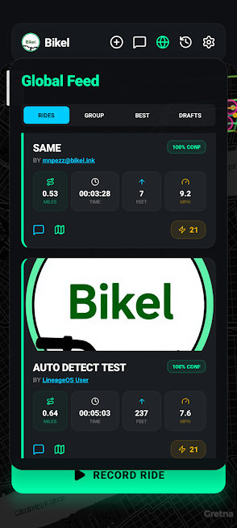
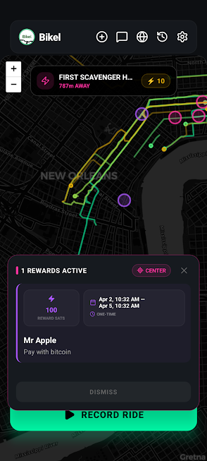
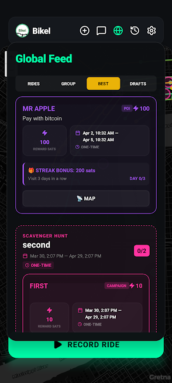
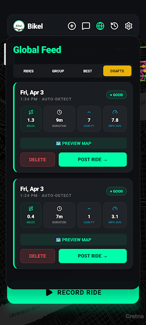
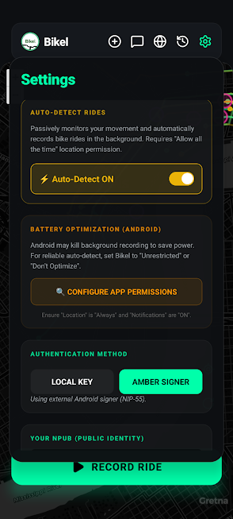

# Bikel 🚲⚡
**Bikel** is an open-source, decentralized mapping and geolocation ecosystem natively built on the Nostr network. It allows cyclists and athletes to passively track rides, overlay photos, organize alleycat races, and distribute lightning-fast Bitcoin micro-payments—all entirely free from traditional proprietary fitness trackers.
Because Bikel uses Nostr and `NIP-52` Time-Based events, your location data belongs permanently to your cryptographic identity. You are free to take your maps to any client or relay you choose.

---
## 📸 Visual Overview (v1.5.0)

| Mobile Feed (MPH) | POI Map Rewards | Scavenger Hunts | Drafts | Settings |
|:---:|:---:|:---:|:---:|:---:|
|  |  |  |  |  |

---
## 🏗️ Architecture
The Bikel platform is divided into four independent components that communicate symbiotically over Nostr websocket relays:

1. **`apk/` (The Mobile Tracker)**
    - Built natively in React Native. Standardized on **NIP-1301** for fitness activities.
    - **v1.5.0 Upgrade**: Migrated to a custom **Native Foreground Service** (bypassing Google Play Services).
    - **De-Googled Support**: Fully compatible with LineageOS and GrapheneOS for reliable background auto-detection.
    - Features "Privacy Tail-Trimming," hardware-bound GPS polling, and offline-first drafting.

2. **`web/` (The Global Dashboard)**
    - React + Vite dashboard for map overlays, NWC zapping, and CC0 data exports.
    - Acts as a social hub for RSVPs, scheduling, and ride discussions.

3. **`relay/` (The Sovereign Backbone)**
    - **New**: A dedicated, high-performance `strfry` (C++) relay hosted on Hetzner.
    - Features a strict whitelist (`filter.js`) to block network spam and prioritize cycling data.
    - Powers the ecosystem with 1,000,000+ simultaneous connection support.

4. **`backend/` (The Escrow Bot)**
    - Node.js bot for managing automated prize pools and contest payouts.

---
## 🚀 Quickstart Guides

### 1. Dedicated Relay (`/relay`)
Launch your own sovereign data infrastructure:
```bash
cd relay
docker compose up -d
```
*See [relay/README.md](./relay/README.md) for host-tuning and DNS instructions.*

### 2. Web Frontend (`/web`)
```bash
cd web
npm install && npm run dev
```

### 3. Escrow Node (`/backend`)
```bash
cd backend
npm install && npm run start
```

### 4. Compiling the APK (`/apk`)
To sideload the native `.apk` straight onto your Android, ensure your phone is on the same WiFi network and USB/wireless debugging is enabled. Then run:
```bash
cd apk
./install.sh --release
```
*This script automates the Expo prebuild, Gradle compilation, and APK sideloading.*

---
---
## 🗺️ Nostr Event Kinds
| Kind | Role | Description |
|------|------|-------------|
| `1301` | **Primary** | Standard Fitness Activity (NIP-1301) |
| `33301` | Legacy | Historical Bikel Ride events (Supported for backfill) |
| `33400` | **Bot** | Bot Announcement: Decentralized discovery, fee rates & relay lists |
| `33401` | **Hunt** | Scavenger Hunt / Challenge: Parent container for POI sets |
| `33402` | **Point** | Checkpoint: Sponsored POI with distance-based rewards |
| `31925` | RSVP | RSVP: Join events/campaigns to track participation |
| `6`     | Feed | Reposts / Boosts |
| `5`     | Admin | Deletion requests |
| `1`     | Social | Ride comments / Shout-outs |

---

## 🎮 Bikel Game Layer
Bikel has evolved from a simple tracker into a decentralized "Live Game." Sponsors can create **Scavenger Hunts** and **Sponsored POIs** that reward physical exertion with automated Bitcoin payouts.

### ⚡ Mechanics
- **📍 Sponsored POIs (Kind 33402)**: Individual points on the map. Entering the 50-meter radius triggers an instant sat payout. Verified with **high-precision coordinate matching** (6 decimal places) to ensure reliability.
- **🧩 Scavenger Hunts (Kind 33401)**: Parent containers that group multiple POIs into a "Set."
- **💰 Completion Bonuses**: Completing a full set (hitting every point in a Kind 33401 hunt) triggers a massive "Set Reward" bonus.
- **🔄 Retroactive Evaluation**: The Bikel Bot uses a "Virtual Hit List" to recognize set completions even if you already received individual checkpoint rewards on previous runs.

### 🧭 Advanced Incentives
- **Daily Streaks**: Multipliers for visiting a specific POI multiple days in a row (configured via `streak_days` for duration and `streak_reward` for bonus sat amount).
- **Ordered Routing**: Bonuses for following specific paths in order (`route_id` → `route_index`).
- **Activity Window**: Expired events remain visible in the feed and on the map for a **7-day grace period** to ensure recent campaign activity is discoverable.

### 🪙 Platform Economics
The ecosystem is self-sustaining through a markup model where sponsors fund prize pools:
- **Sponsors**: Pay a small platform fee (default 5%) to maintain the bot infrastructure.
- **Riders**: Get 100% of the promised reward via Lightning Network.

---

## 🛠️ Infrastructure & Persistence
For developers running their own Bikel Bot:
- **Persistence**: Individual payouts are tracked in `checkpoint_payouts.json`, while completion bonuses are stored in `set_payouts.json`.
- **Coordinate Standard**: The bot synchronizes with the mobile app using NIP-33 `d-tag` coordinates (`lat,lng`) for robust event linking.
- **Relay Backbone**: High-frequency updates are managed by a dedicated `strfry` relay to ensure split-second hit detection.
<truncated 501 bytes>


---

## 📐 Kind 1301 — Fitness Activity (Primary Standard)
Bikel has adopted **NIP-1301** as its primary data standard. This ensures compatibility with the broader Nostr fitness ecosystem while maintaining the high-resolution geometry Bikel is known for.

- **Storage**: Rides are broadcast to `wss://relay.bikel.ink` (and public relays).
- **Format**: Uses standard tags for `distance`, `duration`, and `sport`.
- **Legacy**: `kind: 33301` is still fully supported for reading historical data.

---
## 💡 Philosophy
Bikel ensures structural autonomy by keeping its layers entirely decoupled. By hosting your own **dedicated relay**, you ensure your data is never pruned by public relays and your community always has a fast, reliable place to call home.

You are highly encouraged to fork, audit, reskin, and deploy your own variations of all four instances for your local cycling clubs. Happy Riding! 🚴